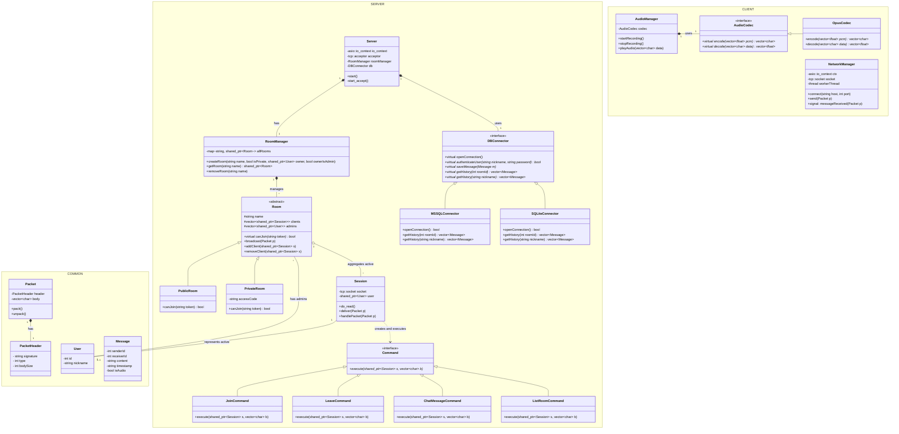
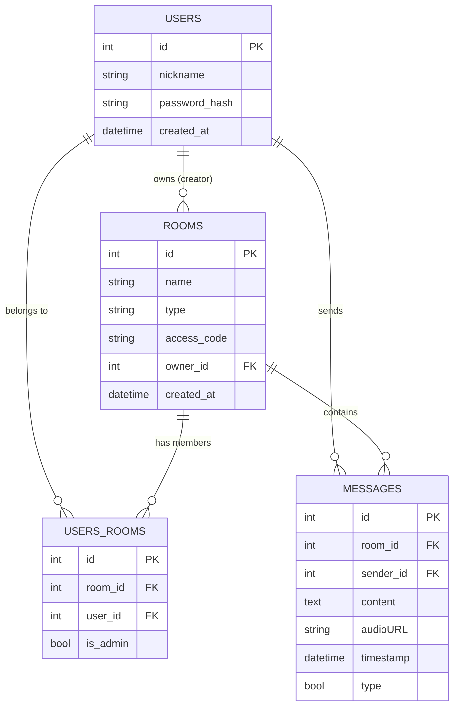

## UML class diagram

### Class descriptions
#### Common classes
##### PacketHeader
Contains definition of a packet header which is used in traffic between server and client.

Params:
* `string signature`: short text which differentiates application packets from other network traffic. Packets without this matching signature will not be processed by application
* `int type`: enum of sent message type - it can be either text, audio or command
* `int bodySize`: representation of size of the sent packet
  
##### Packet
Contains definition of a packet which is sent between server and client.

Params:
* `PacketHeader header`: contains header with information of signature, type and bodySize
* `vector~char~ body`: content of sent message

Methods:
* `pack()`: serializer method which transforms C++ object to raw byte buffer which can be transported via network
* `unpack()`: deserializer method which transforms received raw byte buffer to C++ object

##### Messsage
Contains definition of a single message that was sent.

Params:
* `int senderId`: ID of a user who sent the message
* `int receiverId`: ID of a receiver to whom message was send
* `bool receiverType`: type of receiver, either single user or room
* `string content`: content of a message, either text to display or link to uploaded audio file
* `string timestamp`: timestamp of sending the message
* `bool isAudio`: flag for message type - true means the message is of type audio

##### User
Holds basic information about user.

Params:
* `int id`: ID of a user
* `string nickname`: unique nickname by which user can be identified

## Database Entity Relationship diagram

