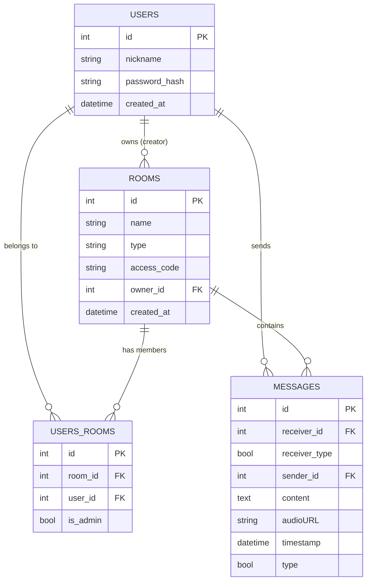

## UML class diagram

### Class descriptions
#### Common classes
##### PacketHeader
Contains definition of a packet header which is used in traffic between server and client.

Params:
* `string signature`: short text which differentiates application packets from other network traffic. Packets without this matching signature will not be processed by application
* `int type`: enum of sent message type - it can be either text, audio or command
* `int bodySize`: representation of size of the sent packet
  
##### Packet
Contains definition of a packet which is sent between server and client.

Params:
* `PacketHeader header`: contains header with information of signature, type and bodySize
* `vector~char~ body`: content of sent message

Methods:
* `pack()`: serializer method which transforms C++ object to raw byte buffer which can be transported via network
* `unpack()`: deserializer method which transforms received raw byte buffer to C++ object

##### Messsage
Contains definition of a single message that was sent.

Params:
* `int senderId`: ID of a user who sent the message
* `int receiverId`: ID of a receiver to whom message was send
* `bool receiverType`: type of receiver, either single user or room
* `string content`: content of a message, either text to display or link to uploaded audio file
* `string timestamp`: timestamp of sending the message
* `bool isAudio`: flag for message type - true means the message is of type audio

##### User
Holds basic information about user.

Params:
* `int id`: ID of a user
* `string nickname`: unique nickname by which user can be identified

#### Server classes
##### Server
The main class of the server application responsible for lifecycle management and network orchestration.

Params:
* `asio::io_context io_context`: core Asio object providing I/O functionality for asynchronous operations
* `tcp::acceptor acceptor`: listens for and accepts incoming TCP connections
* `RoomManager roomManager`: manages the collection of chat rooms
* `DBConnector db`: polymorphic interface for database operations - it is needed to be polymorphic as first in the project there is SQLite database which later will be transformed to MSSQL database

Methods:
* `start()`: initializes the server and starts the I/O context loop
* `start_accept()`: an internal asynchronous method that waits for new client connections and creates new Session objects

##### Session
Represents a single active network connection with a client.

Params:
* `tcp::socket socket`: communication socket used for data transfer
* `shared_ptr~User~ user`: points to the authenticated user associated with this specific connection

Methods:
* `do_read()`: asynchronously reads a Packet from the socket, starting with the header
* `deliver(Packet p)`: sends a Packet to the connected client
* `handlePacket(Packet p)`: internal logic that decodes the packet type and triggers the appropriate logic

##### RoomManager
A central registry for all chat rooms existing on the server. It manages rooms and holds their state.

Params:
* `map~string, shared_ptr~Room~~ allRooms`: a collection mapping room names to room objects

Methods:
* `createRoom(...)`: instantiates a new PublicRoom or PrivateRoom and adds it to the registry
* `getRoom(string name)`: retrieves a pointer to a specific room
* `removeRoom(string name)`: closes a room and removes it from the registry

##### Room
An abstract base class representing a chat room.

Params:
* `string name`: name of the room
* `vector~shared_ptr~Session~~ clients`: list of sessions currently active in the room. It does not need to hold all users which are members of the room, as it is a task for database - here only active users will be added, so messages can be delivered to them.
* `vector~shared_ptr~User~~ admins`: list of users with administrative privileges in the room

Methods:
* `canJoin(string token)*`: pure virtual method to check if a user is allowed to enter (e.g., password check)
* `broadcast(Packet p)`: iterates through all active sessions and delivers the packet to each
* `addClient/removeClient(...)`: manages the list of active participants

##### Command
A polymorphic interface for executing business logic based on received network packets.

Methods:
* `execute(session, body)*`: pure virtual method that defines the specific action to be taken (e.g., joining a room or saving a message)

##### DBConnector
An interface for abstraction over different database engines (SQLite, MSSQL).

Methods:
* `openConnection()`: establishes a connection to the database file or server
* `authenticateUser(...)`: validates user credentials against stored data
* `saveMessage(Message m)`: persists a message object in the database
* `getHistory(...)`: retrieves a collection of messages based on room ID or user nickname. Thanks to method overload the application can retrieve data from proper table in database

#### Client classes
##### NetworkManager
Handles all network communication on the client side using an asynchronous thread.

Params:
* `asio::io_context ctx`: manages asynchronous I/O operations
* `tcp::socket socket`: TCP socket connected to the server
* `thread workerThread`: dedicated thread for running the Asio context to prevent GUI freezing

Methods:
* `connect(host, port)`: establishes a connection to the server
* `send(Packet p)`: serializes and sends a packet to the server
* `messageReceived(Packet p)`: a Qt signal emitted when a new packet arrives from the server

##### AudioManager
Manages audio hardware for recording and playing voice messages.

Params:
* `AudioCodec codec`: reference to a codec used for compression and decompression

Methods:
* `startRecording()`: initializes microphone input and starts capturing audio frames
* `playAudio(vector~char~ data)`: decompresses received audio data and sends it to the speakers

##### AudioCodec
An abstract interface for audio data processing.

Methods:
* `encode(...)*`: transforms raw PCM audio into a compressed byte buffer
* `decode(...)*`: transforms compressed bytes back into raw PCM audio for playback

## Database Entity Relationship diagram

