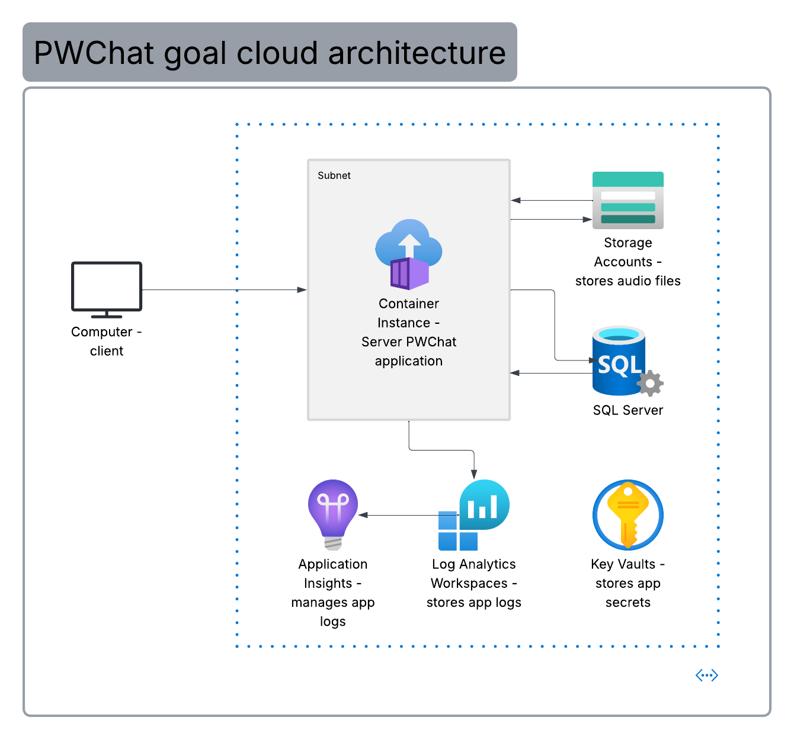
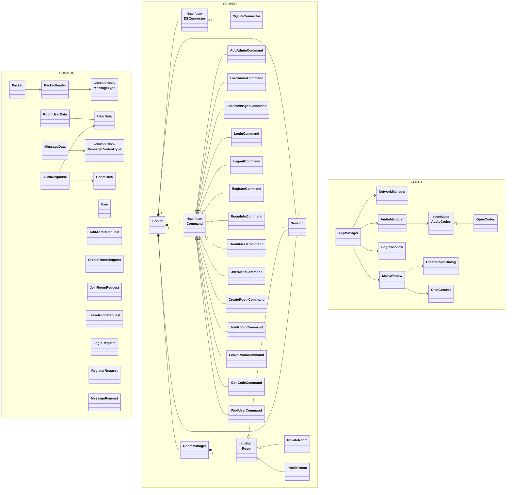
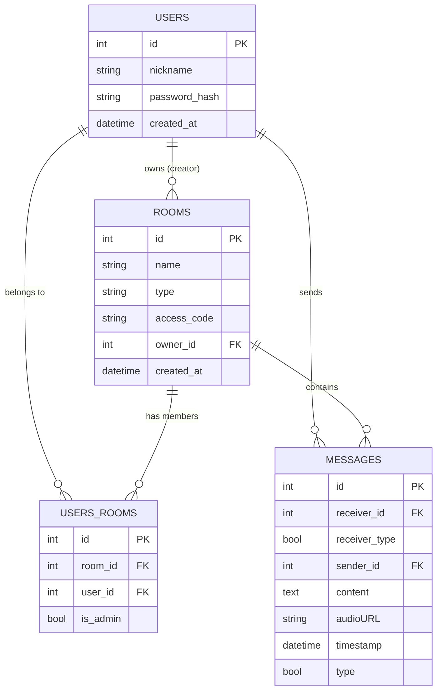

## Goal cloud architecture
Below diagram shows goal architecture of application. Each client will have client version of app installed on their machine. Server will work as a container in Azure Container Instances, which will allow easier scaling. Audio files will be stored as blobs in Azure Storage Account and database will run on MSSQL server. Any secrets to the application or its resources will be safely stored in Azure Key Vault. Application logs will be stored and collected because of Application Insights and Log Analytics Workspace.

In the future, in case of need for upscaling application, horizontal scaling could be implemented. Adding new containers will require additional resource of Azure Cache for Redis which will act as connector for messages between servers. It would work as publishers and subscribers. If one user would be managed by server A and send a message to another user managed by server B, this mechanism would be necessary for proper traffic flow.



## UML class diagram
```mermaid
classDiagram
   %% RELATION DEFINITIONS
   %% SERVER RELATIONS
   DBConnector <|-- SQLiteConnector
   Server *-- DBConnector : owns m_db
   Server "1" *-- "*" Session : tracks active connections via m_clients
   Session --> Server : holds reference to m_server
   Room <|-- PrivateRoom
   Room <|-- PublicRoom
   RoomManager "1" *-- "*" Room : aggregates m_allRooms
   Server *-- RoomManager : owns m_roomManager
   Room "*" o-- "*" Session : contains active members
   Command <|-- AddAdminCommand
   Command <|-- LoadAudioCommand
   Command <|-- LoadMessagesCommand
   Command <|-- LoginCommand
   Command <|-- LogoutCommand
   Command <|-- RegisterCommand
   Command <|-- RoomInfoCommand
   Command <|-- RoomMessCommand
   Command <|-- UserMessCommand
   Command <|-- CreateRoomCommand
   Command <|-- JoinRoomCommand
   Command <|-- LeaveRoomCommand
   Command <|-- GenCodeCommand
   Command <|-- FindUserCommand

   Server "1" *-- "*" Command : routes routing map via m_commands

   %% CLIENT RELATIONS
       
   AppManager --> NetworkManager : owns m_networkManager
   AppManager --> AudioManager : owns m_audioManager
   AppManager --> LoginWindow : composes m_loginWin
   AppManager --> MainWindow : composes m_mainWin
   MainWindow ..> CreateRoomDialog : spawns via slot
   AudioCodec <|-- OpusCodec
   MainWindow --> ChatContext : tracks m_currentChat
   AudioManager --> AudioCodec : manages via m_codec

   %% COMMON RELATIONS
   Packet --> PacketHeader : contains m_header
   PacketHeader --> MessageType : uses
   RoomUserData --> UserData : stores lists of
   MessageData --> MessageContentType : categorization
   AuthResponse --> UserData : recent chats list
   AuthResponse --> RoomData : active rooms list

   %% COMMON CLASSES
   namespace COMMON {
       class MessageType {
       <<enumeration>>
       MESS_TO_USER = 0
       MESS_TO_ROOM = 1
       LOAD_AUDIO = 2
       AUDIO_TO_ROOM = 3
       LOGIN_REQUEST = 4
       ERROR_RESPONSE = 5
       JOIN_ROOM_COMM = 6
       LEAVE_ROOM_REQUEST = 7
       CREATE_ROOM_COMM = 8
       DEL_ROOM_COMM = 9
       REGISTER_REQUEST = 10
       LOGOUT_REQUEST = 11
       ROOM_INFO_REQUEST = 12
       ADD_ADMIN_REQUEST = 13
       LOAD_MESS_REQUEST = 14
       GEN_CODE_REQUEST = 15
       ACCESS_CODE_REQUIRED = 16
       FIND_USER_REQUEST = 17
   }

   class MessageContentType {
       <<enumeration>>
       TEXT = 0
       AUDIO = 1
   }

   class PacketHeader {
       +uint32_t signature
       +MessageType type
       +uint32_t targetId
       +uint32_t senderId
       +uint32_t bodySize
   }

   class Packet {
       -PacketHeader m_header
       -vector~char~ m_body
       +Packet()
       +Packet(header : PacketHeader&, body : vector~char~&)
       +pack() vector~char~
       +header() PacketHeader&
       +body() vector~char~&
       +serialize(archive : Archive&) void
       +unpackBody() T
       +Packet(type : MessageType, targetId : uint32_t, senderId : uint32_t, data : T&)
   }


   class User {
       -uint32_t m_id
       -string m_nickname
       +User(id : uint32_t, nickname : string)
       +~User()
       +id() uint32_t
       +nickname() string
       +setId(id : uint32_t) void
       +setNickname(nick : string) void
   }

   class UserData {
       +uint32_t id
       +string nickname
       +serialize(archive : Archive&) void
   }

   class RoomData {
       +uint32_t id
       +string name
       +bool isPrivate
       +uint32_t ownerId
       +serialize(archive : Archive&) void
   }

   class RoomUserData {
       +uint32_t id
       +string name
       +bool isPrivate
       +uint32_t accessCode
       +vector~UserData~ users
       +vector~UserData~ admins
       +serialize(archive : Archive&) void
   }


   class AddAdminRequest {
       +uint32_t roomId
       +uint32_t userId
       +serialize(archive : Archive&) void
   }

   class CreateRoomRequest {
       +string roomName
       +bool isPrivate
       +bool isAdmin
       +serialize(archive : Archive&) void
   }

   class JoinRoomRequest {
       +string name
       +uint32_t token
       +serialize(archive : Archive&) void
   }

   class LeaveRoomRequest {
       +uint32_t roomId
       +uint32_t userId
       +serialize(archive : Archive&) void
   }

   class LoginRequest {
       +uint32_t id
       +string nickname
       +string password
       +serialize(archive : Archive&) void
   }

   class RegisterRequest {
       +uint32_t id
       +string nickname
       +string password
       +serialize(archive : Archive&) void
   }

   class MessageRequest {
       +uint32_t targetId
       +uint32_t offset
       +bool fromRoom
       +serialize(archive : Archive&) void
   }

   class MessageData {
       +uint32_t senderId
       +string senderName
       +uint32_t targetId
       +string message
       +MessageContentType messageType
       +serialize(archive : Archive&) void
   }

   class AuthResponse {
       +uint32_t myId
       +string myNickname
       +vector~UserData~ userChats
       +vector~RoomData~ userRooms
       +serialize(archive : Archive&) void
   }
   }

   %% SERVER CLASSES
   namespace SERVER {
       class Server {
       -RoomManager m_roomManager
       -unique_ptr~DBConnector~ m_db
       -tcp__acceptor m_acceptor
       -map~uint32_t_shared_ptr~Session~~ m_clients
       -mutex m_clientsMutex
       -map~MessageType_unique_ptr~Command~~ m_commands
       +Server(io_context& io_context, short port)
       +~Server()
       +onPacketReceived(session : shared_ptr~Session~, p : Packet&) void
       +routePacket(p : Packet&) void
       +insertClient(session : shared_ptr~Session~) void
       +removeClient(session : shared_ptr~Session~) void
       +loadDataFromDB() void
       +client(clientId : uint32_t) shared_ptr~Session~
       +roomManager() RoomManager&
       +db() DBConnector&
       -do_accept() void
   }

   class Session {
       -tcp__socket m_socket
       -streambuf m_buffer
       -Server& m_server
       -shared_ptr~User~ m_user
       -bool m_isAuthenticated
       +Session(socket : tcp__socket, server : Server&)
       +~Session()
       +userId() uint32_t
       +user() shared_ptr~User~
       +setUser(id : uint32_t, nickname : string) void
       +doRead() void
       +deliver(p : Packet&) void
       +isAuthenticated() bool
       +logout() void
       -waitForRequest() void
       -readBody(header : PacketHeader) void
   }


   class DBConnector {
       <<interface>>
       +~DBConnector()*
       +connect(dbPath : string&)* bool
       +disconnect()* void
       +initializeSchema()* void
       +getAllRooms()* vector~RoomData~
       +getUserRooms(userId : uint32_t)* vector~RoomData~
       +saveRoom(name : string&, isPrivate : bool, ownerId : uint32_t)* int
       +saveUserRoom(userId : uint32_t, roomId : uint32_t, isAdmin : bool)* bool
       +deleteUserRoom(userId : uint32_t, roomId : uint32_t)* bool
       +registerUser(nickname : string&, password : string&)* uint32_t
       +loginUser(nickname : string&, password : string&)* uint32_t
       +getRoomUsers(roomId : uint32_t, getAdmins : bool)* vector~UserData~
       +addAdmin(roomId : uint32_t, userId : uint32_t)* bool
       +saveMessage(senderID : uint32_t, targetId : uint32_t, message : string&, type : MessageContentType&, toRoom : bool)* bool
       +getMessages(targetId : uint32_t, senderId : uint32_t, fromRoom : bool, limit : int, offset : int)* vector~MessageData~
       +saveRoomCode(roomId : uint32_t, code : uint32_t)* bool
       +getRoomCode(roomId : uint32_t)* uint32_t
       +getUsername(userId : uint32_t)* string
       +getLastUserPrivChats(userId : uint32_t)* vector~UserData~
       +findUserByNick(username : string)* uint32_t
   }

   class SQLiteConnector {
       -sqlite3* m_db
       +SQLiteConnector()
       +~SQLiteConnector()
       +connect(dbPath : string&) bool
       +disconnect() void
       +initializeSchema() void
       +getAllRooms() vector~RoomData~
       +getUserRooms(userId : uint32_t) vector~RoomData~
       +saveRoom(name : string&, isPrivate : bool, ownerId : uint32_t) int
       +saveUserRoom(userId : uint32_t, roomId : uint32_t, isAdmin : bool) bool
       +deleteUserRoom(userId : uint32_t, roomId : uint32_t) bool
       +registerUser(nickname : string&, password : string&) uint32_t
       +loginUser(nickname : string&, password : string&) uint32_t
       +getRoomUsers(roomId : uint32_t, getAdmins : bool) vector~UserData~
       +addAdmin(roomId : uint32_t, userId : uint32_t) bool
       +saveMessage(senderID : uint32_t, targetId : uint32_t, message : string&, type : MessageContentType&, toRoom : bool) bool
       +getMessages(targetId : uint32_t, senderId : uint32_t, fromRoom : bool, limit : int, offset : int) vector~MessageData~
       +saveRoomCode(roomId : uint32_t, code : uint32_t) bool
       +getRoomCode(roomId : uint32_t) uint32_t
       +getUsername(userId : uint32_t) string
       +getLastUserPrivChats(userId : uint32_t) vector~UserData~
       +findUserByNick(username : string) uint32_t
   }

   class RoomManager {
       -map~uint32_t_shared_ptr~Room~~ m_allRooms
       -map~string_shared_ptr~Room~~ m_allRoomsByName
       +allRooms() map~uint32_t_shared_ptr~Room~~
       +getRoom(id : uint32_t) shared_ptr~Room~
       +getRoom(name : string) shared_ptr~Room~
       +createRoom(roomId : uint32_t, name : string, isPrivate : bool, ownerId : uint32_t) shared_ptr~Room~
       +removeRoom(name : string) void
       +initialize(rooms : vector~RoomData~&) void
       +loginInitialize(rooms : vector~RoomData~&, session : shared_ptr~Session~) void
       +logoutInitialize(rooms : vector~RoomData~&, session : shared_ptr~Session~) void
   }

   class Room {
       <<abstract>>
       #uint32_t m_id
       #string m_name
       #uint32_t m_ownerId
       #vector~shared_ptr~Session~~ m_clients
       #vector~uint32_t~ m_adminIds
       +Room(id : uint32_t, name : string, ownerId : uint32_t)
       +~Room()*
       +id() uint32_t
       +name() string
       +ownerId() uint32_t
       +addClient(clientToAdd : shared_ptr~Session~) void
       +removeClient(clientToRemove : shared_ptr~Session~) void
       +canJoin(token : string&)* bool
       +broadcast(p : Packet&, skipSender : bool) void
       +addAdmin(adminId : uint32_t) void
       +removeAdmin(adminId : uint32_t) void
       +checkIfAdmin(userId : uint32_t) bool
   }

   class PrivateRoom {
       -string m_accessCode
       +PrivateRoom(id : uint32_t, name : string, ownerId : uint32_t)
       +~PrivateRoom()
       +canJoin(token : string&) bool
   }

   class PublicRoom {
       +PublicRoom(id : uint32_t, name : string, ownerId : uint32_t)
       +~PublicRoom()
       +canJoin(token : string&) bool
   }


   class Command {
       <<interface>>
       +~Command()*
       +execute(session : shared_ptr~Session~, p : Packet&, server : Server&)* void
   }

   class AddAdminCommand { +execute(...) void }
   class LoadAudioCommand { +execute(...) void }
   class LoadMessagesCommand { +execute(...) void }
   class LoginCommand { +execute(...) void }
   class LogoutCommand { +execute(...) void }
   class RegisterCommand { +execute(...) void }
   class RoomInfoCommand { +execute(...) void }
   class RoomMessCommand { +execute(...) void }
   class UserMessCommand { +execute(...) void }
   class CreateRoomCommand { +execute(...) void }
   class JoinRoomCommand { +execute(...) void }
   class LeaveRoomCommand { +execute(...) void }
   class GenCodeCommand { +execute(...) void }
   class FindUserCommand { +execute(...) void }
   }

   %% CLIENT CLASSES
   namespace CLIENT {
       class AppManager {
           <<QObject>>
           -NetworkManager* m_networkManager
           -AudioManager* m_audioManager
           -LoginWindow m_loginWin
           -MainWindow m_mainWin
           -QPushButton* m_currentPlayingButton
           +AppManager(parent : QObject*)
           +~AppManager()
           +start() void
           -setupConnections() void
       }
   
       class AudioCodec {
           <<interface>>
           +~AudioCodec()*
           +encode(pcmData : vector~float~)* vector~char~
           +decode(compressedData : vector~char~)* vector~float~
       }
   
       class OpusCodec {
           -OpusEncoder* m_encoder
           -OpusDecoder* m_decoder
           -int m_frameSize
           +OpusCodec()
           +~OpusCodec()
           +encode(pcmData : vector~float~) vector~char~
           +decode(compressedData : vector~char~) vector~float~
       }
   
       class AudioManager {
           <<QObject>>
           -QAudioSource* m_audioSource
           -QBuffer m_buffer
           -QByteArray m_audioData
           -shared_ptr~AudioCodec~ m_codec
           +AudioManager()
           +~AudioManager()
           +startRecording() void
           +stopRecording() void
           +playAudio(pcmData : vector~float~, playButton : QPushButton*) void
           +codec() shared_ptr~AudioCodec~
           #audioReadyToSend(compressedData : vector~char~)
           #audioFinishedPlaying(playButton : QPushButton*)
       }
   

   
       class LoginWindow {
           <<QMainWindow>>
           -Ui::LoginWindow* ui
           +LoginWindow(parent : QWidget*)
           +~LoginWindow()
           +resetForms() void
           -on_btnLogin_clicked() void
           -on_btnRegister_clicked() void
           #loginRequested(nickname : string, password : string)
           #registerRequested(nickname : string, password : string)
           #registerError()
       }
   
       class CreateRoomDialog {
           <<QDialog>>
           -Ui::CreateRoomDialog* ui
           +CreateRoomDialog(parent : QWidget*)
           +~CreateRoomDialog()
           -on_buttonBox_accepted() void
           #createRoomRequested(roomName : string, isPrivate : bool, isAdmin : bool)
       }
   
       class MainWindow {
           <<QMainWindow>>
           -Ui::MainWindow* ui
           -uint32_t m_userId
           -vector~RoomData~ m_userRooms
           -vector~UserData~ m_recentUsers
           -bool m_isWaitingForCode
           -string m_pendingRoomName
           -ChatContext m_currentChat
           -bool m_isLoadingHistory
           +MainWindow(parent : QWidget*)
           +~MainWindow()
           +currentChat() ChatContext
           +userId() uint32_t
           +onMessageReceived(senderId : uint32_t, senderName : QString&, targetId : uint32_t, msgType : MessageContentType&, text : QString&, toRoom : bool) void
           +displayOlderMessages(messages : vector~MessageData~, userId : uint32_t) void
           +appendMessage(sender : QString&, msgType : MessageContentType&, text : QString&, isFromOthers : bool, addToTop : bool, topIndex : uint8_t) void
           +appendUserRoomWidget(id : uint32_t, name : QString&, isRoom : bool) void
           +appendUserWidget(id : uint32_t, name : QString&, isAdmin : bool, amIAdmin : bool) void
           +afterLoginChanges(res : AuthResponse&) void
           +addRoom(room : RoomData&) void
           +onChatWidgetClicked(id : uint32_t, isRoom : bool) void
           +displayRoomInfo(isPrivate : bool, users : vector~UserData~, admins : vector~UserData~, amIAdmin : bool, accessCode : uint32_t, isAdministered : bool) void
           +leaveRoom(roomId : uint32_t) void
           +showContextMenu(pos : QPoint&, userId : uint32_t) void
           +scrollToBottom() void
           +displayGeneratedCode(code : QString&) void
           +requestCode(roomName : string) void
           -createMessageWidget(senderId : QString&, message : QString&, isFromOthers : bool) QWidget*
           -createAudioMessageWidget(senderId : QString&, message : QString&, isFromOthers : bool) QWidget*
           -createUserRoomWidget(name : QString&, isRoom : bool) QPushButton*
           -createUserWidget(name : QString&) QPushButton*
           -clearLayout(layout : QLayout*, startingIdx : uint) void
           -resetJoinRoom() void
           -on_btnSend_clicked() void
           -on_btnCreateRoom_clicked() void
           -on_btnJoinRoom_clicked() void
           -on_btnRecordAudio_pressed() void
           -on_btnRecordAudio_released() void
           -on_btnLogout_clicked() void
           -on_btnExit_clicked() void
           -on_btnLeave_clicked() void
           -on_btnGenerateCode_clicked() void
           -on_btnTalkToUser_clicked() void
           #sendRequested(targetId : uint32_t, message : string, toRoom : bool)
           #createRoomRequested(roomName : string, isPrivate : bool, isAdmin : bool)
           #joinRoomRequested(roomName : string, code : uint32_t)
           #audioRecordingStarted()
           #audioRecordingStopped()
           #logoutRequested()
           #roomInfoRequest(roomId : uint32_t)
           #leaveRoomRequested(roomId : uint32_t, userId : uint32_t)
           #addAdminRequest(roomId : uint32_t, userId : uint32_t)
           #loadMessages(targetId : uint32_t, offset : uint32_t, fromRoom : bool)
           #voicePlayRequested(fileName : string&, clickedButton : QPushButton*)
           #generateCodeRequested(roomId : uint32_t)
           #newPrivChatRequested(username : string)
       }
   
       class ChatContext {
           +uint32_t id
           +string chatType
           +operator==(other : ChatContext&) bool
       }
   
       
   
       class NetworkManager {
           <<QObject>>
           -shared_ptr~User~ m_user
           -io_context m_io_context
           -tcp__socket m_socket
           +connect(host : string, port : string) void
           +send(p : Packet&) void
           +doRead() void
       }

   }
```

## Simplified UML class diagram


```mermaid
classDiagram
    %% --- DEFINICJE RELACJI ---
    
    %% SERVER
    DBConnector <|-- SQLiteConnector
    Server *-- DBConnector
    Server "1" *-- "*" Session
    Session --> Server
    Room <|-- PrivateRoom
    Room <|-- PublicRoom
    RoomManager "1" *-- "*" Room
    Server *-- RoomManager
    Room "*" o-- "*" Session

    Command <|-- AddAdminCommand
    Command <|-- LoadAudioCommand
    Command <|-- LoadMessagesCommand
    Command <|-- LoginCommand
    Command <|-- LogoutCommand
    Command <|-- RegisterCommand
    Command <|-- RoomInfoCommand
    Command <|-- RoomMessCommand
    Command <|-- UserMessCommand
    Command <|-- CreateRoomCommand
    Command <|-- JoinRoomCommand
    Command <|-- LeaveRoomCommand
    Command <|-- GenCodeCommand
    Command <|-- FindUserCommand

    Server "1" *-- "*" Command

    %% CLIENT
    AppManager --> NetworkManager
    AppManager --> AudioManager
    AppManager --> LoginWindow
    AppManager --> MainWindow
    MainWindow ..> CreateRoomDialog
    AudioCodec <|-- OpusCodec
    MainWindow --> ChatContext
    AudioManager --> AudioCodec

    %% COMMON
    Packet --> PacketHeader
    PacketHeader --> MessageType
    RoomUserData --> UserData
    MessageData --> MessageContentType
    AuthResponse --> UserData
    AuthResponse --> RoomData

    %% --- BLOKI KLAS (PUSTE BOKSY BEZ METOD I POL) ---

    namespace COMMON {
        class MessageType { <<enumeration>> }
        class MessageContentType { <<enumeration>> }
        class PacketHeader
        class Packet
        class User
        class UserData
        class RoomData
        class RoomUserData
        class AddAdminRequest
        class CreateRoomRequest
        class JoinRoomRequest
        class LeaveRoomRequest
        class LoginRequest
        class RegisterRequest
        class MessageRequest
        class MessageData
        class AuthResponse
    }

    namespace SERVER {
        class Server
        class Session
        class DBConnector { <<interface>> }
        class SQLiteConnector
        class RoomManager
        class Room { <<abstract>> }
        class PrivateRoom
        class PublicRoom
        class Command { <<interface>> }
        class AddAdminCommand
        class LoadAudioCommand
        class LoadMessagesCommand
        class LoginCommand
        class LogoutCommand
        class RegisterCommand
        class RoomInfoCommand
        class RoomMessCommand
        class UserMessCommand
        class CreateRoomCommand
        class JoinRoomCommand
        class LeaveRoomCommand
        class GenCodeCommand
        class FindUserCommand
    }

    namespace CLIENT {
        class AppManager
        class AudioCodec { <<interface>> }
        class OpusCodec
        class AudioManager
        class LoginWindow
        class CreateRoomDialog
        class MainWindow
        class ChatContext
        class NetworkManager
    }
```

### Class descriptions
#### Common classes
##### PacketHeader
Contains definition of a packet header which is used in traffic between server and client.

Params:
* `string signature`: short text which differentiates application packets from other network traffic. Packets without this matching signature will not be processed by application
* `int type`: enum of sent message type - it can be either text, audio or command
* `int bodySize`: representation of size of the sent packet
  
##### Packet
Contains definition of a packet which is sent between server and client.

Params:
* `PacketHeader header`: contains header with information of signature, type and bodySize
* `vector~char~ body`: content of sent message

Methods:
* `pack()`: serializer method which transforms C++ object to raw byte buffer which can be transported via network
* `unpack()`: deserializer method which transforms received raw byte buffer to C++ object

##### Messsage
Contains definition of a single message that was sent.

Params:
* `int senderId`: ID of a user who sent the message
* `int receiverId`: ID of a receiver to whom message was send
* `bool receiverType`: type of receiver, either single user or room
* `string content`: content of a message, either text to display or link to uploaded audio file
* `string timestamp`: timestamp of sending the message
* `bool isAudio`: flag for message type - true means the message is of type audio

##### User
Holds basic information about user.

Params:
* `int id`: ID of a user
* `string nickname`: unique nickname by which user can be identified

#### Server classes
##### Server
The main class of the server application responsible for lifecycle management and network orchestration.

Params:
* `asio::io_context io_context`: core Asio object providing I/O functionality for asynchronous operations
* `tcp::acceptor acceptor`: listens for and accepts incoming TCP connections
* `RoomManager roomManager`: manages the collection of chat rooms
* `DBConnector db`: polymorphic interface for database operations - it is needed to be polymorphic as first in the project there is SQLite database which later will be transformed to MSSQL database

Methods:
* `start()`: initializes the server and starts the I/O context loop
* `start_accept()`: an internal asynchronous method that waits for new client connections and creates new Session objects

##### Session
Represents a single active network connection with a client.

Params:
* `tcp::socket socket`: communication socket used for data transfer
* `shared_ptr~User~ user`: points to the authenticated user associated with this specific connection

Methods:
* `do_read()`: asynchronously reads a Packet from the socket, starting with the header
* `deliver(Packet p)`: sends a Packet to the connected client
* `handlePacket(Packet p)`: internal logic that decodes the packet type and triggers the appropriate logic

##### RoomManager
A central registry for all chat rooms existing on the server. It manages rooms and holds their state.

Params:
* `map~string, shared_ptr~Room~~ allRooms`: a collection mapping room names to room objects

Methods:
* `createRoom(...)`: instantiates a new PublicRoom or PrivateRoom and adds it to the registry
* `getRoom(string name)`: retrieves a pointer to a specific room
* `removeRoom(string name)`: closes a room and removes it from the registry

##### Room
An abstract base class representing a chat room.

Params:
* `string name`: name of the room
* `vector~shared_ptr~Session~~ clients`: list of sessions currently active in the room. It does not need to hold all users which are members of the room, as it is a task for database - here only active users will be added, so messages can be delivered to them.
* `vector~shared_ptr~User~~ admins`: list of users with administrative privileges in the room

Methods:
* `canJoin(string token)*`: pure virtual method to check if a user is allowed to enter (e.g., password check)
* `broadcast(Packet p)`: iterates through all active sessions and delivers the packet to each
* `addClient/removeClient(...)`: manages the list of active participants

##### Command
A polymorphic interface for executing business logic based on received network packets.

Methods:
* `execute(session, body)*`: pure virtual method that defines the specific action to be taken (e.g., joining a room or saving a message)

##### DBConnector
An interface for abstraction over different database engines (SQLite, MSSQL).

Methods:
* `openConnection()`: establishes a connection to the database file or server
* `authenticateUser(...)`: validates user credentials against stored data
* `saveMessage(Message m)`: persists a message object in the database
* `getHistory(...)`: retrieves a collection of messages based on room ID or user nickname. Thanks to method overload the application can retrieve data from proper table in database

#### Client classes
##### NetworkManager
Handles all network communication on the client side using an asynchronous thread.

Params:
* `asio::io_context ctx`: manages asynchronous I/O operations
* `tcp::socket socket`: TCP socket connected to the server
* `thread workerThread`: dedicated thread for running the Asio context to prevent GUI freezing

Methods:
* `connect(host, port)`: establishes a connection to the server
* `send(Packet p)`: serializes and sends a packet to the server
* `messageReceived(Packet p)`: a Qt signal emitted when a new packet arrives from the server

##### AudioManager
Manages audio hardware for recording and playing voice messages.

Params:
* `AudioCodec codec`: reference to a codec used for compression and decompression

Methods:
* `startRecording()`: initializes microphone input and starts capturing audio frames
* `playAudio(vector~char~ data)`: decompresses received audio data and sends it to the speakers

##### AudioCodec
An abstract interface for audio data processing.

Methods:
* `encode(...)*`: transforms raw PCM audio into a compressed byte buffer
* `decode(...)*`: transforms compressed bytes back into raw PCM audio for playback

## Database Entity Relationship diagram

```mermaid
erDiagram
USERS ||--o{ USERS_ROOMS : "belongs to"
    ROOMS ||--o{ USERS_ROOMS : "has members"
    USERS ||--o{ MESSAGES : "sends"
    ROOMS ||--o{ MESSAGES : "contains"
    USERS ||--o{ ROOMS : "owns (creator)"

    USERS {
        int id PK
        string nickname
        string password_hash
        datetime created_at
    }
    ROOMS {
        int id PK
        string name
        string type
        string access_code
        int owner_id FK
        datetime created_at
    }
    MESSAGES {
        int id PK
        int receiver_id FK
        bool receiver_type
        int sender_id FK
        text content
        string audioURL
        datetime timestamp
        bool type
    }
    USERS_ROOMS {
        int id PK
        int room_id FK
        int user_id FK
        bool is_admin
    }
```
